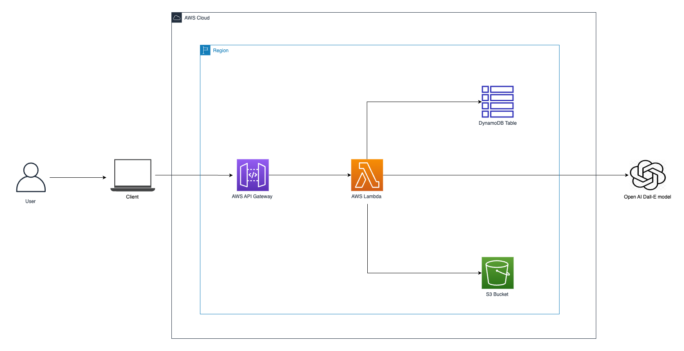

# DALL-E Image Generator Application

This application takes a text prompt from the user and generates an image based on the input using the DALL-E AI model. It uses a React front-end application to take user inputs and an AWS Lambda function to generate the image. The generated image is stored in an S3 bucket and a pre-signed URL is provided to the user for viewing the image. The application also saves image metadata, including the URL and the text prompt, in a DynamoDB table.


This project is a simple image generator using the OpenAI DALL-E API. It's composed of a React frontend and a Python AWS Lambda backend.

## Getting Started

These instructions will guide you on how to run this application.

### Architecture Diagram



### Prerequisites

* AWS account
* AWS CLI installed and configured
* Node.js and NPM
* Python 3.10+
* AWS SAM CLI

### Generating OpenAI API Key

1. Go to the [OpenAI website](https://platform.openai.com/signup/).
2. Sign up for an account.
3. After successful sign-up and verification, log in to your account.
4. Navigate to the API Keys section.
5. Generate a new API key. Note down the API key for future use.

### Storing OpenAI API Key in AWS Secrets Manager

1. Install the AWS CLI and configure it with your AWS credentials if you haven't already.
2. Use the following command to store your OpenAI API key as a secret in AWS Secrets Manager. Replace `MySecretName`, `key1`, and `value1` with your actual secret name and key-value pair. For example, you could name the key `openai_api_key` and set its value to your actual OpenAI API key.

```bash
aws secretsmanager create-secret --name MySecretName --secret-string '{"key1":"value1"}'
```

Also remember to modify the secret_name in the lambda function to match accordingly to the `MySecretName`.

## Technologies Used

1. ReactJS
2. AWS Lambda
3. AWS API Gateway
4. AWS S3
5. AWS DynamoDB
6. OpenAI's DALL-E Model

## Local Setup

### Frontend

1. Clone the repository.
2. Navigate to the `frontend` directory.
3. Create a `.env` file in the root directory of your project. Add the API Gateway endpoint URL as `REACT_APP_AWS_API_GATEWAY` like so:

```bash
REACT_APP_AWS_API_GATEWAY=https://your-api-gateway-url
```

4. Install the dependencies using `npm install`.
5. Start the application using `npm start`.
6. Open `http://localhost:3000` to view it in the browser.

### Backend

The backend is hosted on AWS using Lambda and API Gateway. The Lambda function is triggered by a POST request to the API Gateway endpoint. You will need to setup your AWS services and deploy the Lambda function.

## AWS Setup

1. Create an S3 bucket.
2. Create a DynamoDB table with `prompt` as the partition key and `timestamp` as the sort key.
3. Create an AWS Lambda function and add the provided Python code. Add your OpenAI key and the names of your S3 bucket and DynamoDB table as environment variables.
4. Setup an API Gateway to trigger the Lambda function.

## Usage

1. Open the React application in your browser.
2. Enter a text prompt in the provided input field.
3. Click "Generate Image".
4. The application will show a loading icon while the image is being generated.
5. Once the image is generated, it will be displayed in the application.

## License

This project is licensed under the terms of the MIT license.
